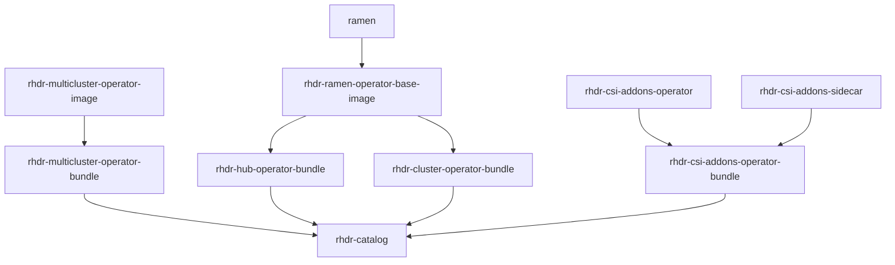

# Hierarchy

To get a code change into a working build of rhdr ramen, you will need to build the entire chain to get that change into an FBC image. For instance; making a change in the `ramen` golang code, I would need to:

1. Update the submodule inside the `rhdr-ramen-operator-base-image` repo and allow it to build
2. Copy the digest of the built image from konflux into the `rhdr-hub-operator-bundle` and `rhdr-cluster-operator-bundle` repos and allow them to build
3. Copy both new digests into the `rhdr-catalog` File Based Catalog (FBC) repo's bundle-images.env file and allow that to rebuild

Then and only then can you copy the digest of the `rhdr-catalog` (FBC) into a catalog-source in your cluster or validated pattern to get the latest code changes.

See the diagram below for a visual representation of component relationships in [Konflux](https://konflux-ui.apps.stone-prod-p02.hjvn.p1.openshiftapps.com/ns/rhdr-tenant/applications/rhdr-4-22/components).
**All these repos can be found in our gitlab project [HERE](https://gitlab.cee.redhat.com/rh-ocp-dr)**
**(Note: rh-ocp-dr/ramen is being replaced by [github.com/redhat-dr/ramen](https://github.com/redhat-dr/ramen))**

_(Note that I've omitted rhdr-must-gather and ramendr-console. The must-gather is its own thing and stands on its own. The console is shelved for now because the mco console is working for us for now)_

# Building

[Konflux](https://konflux-ui.apps.stone-prod-p02.hjvn.p1.openshiftapps.com/ns/rhdr-tenant/applications/rhdr-4-22/components) is set up to build images on push to the `4.22` branch as well as any commit added to a Merge Request (MR).

_(The configuration for the pipelines is in the `.tekton` directory in each git repo)_

While the MR builds can be good to quickly validate that the build will succeed and can be pulled for manual testing, its somewhat tricky to get them built into the catalog image.

You technically could submit another MR referencing the MR build, for instance making a MR for `rhdr-csi-addons-operator-bundle` with a digest from a MR build of `rhdr-csi-addons-sidecar`, then take _that_ digest and make an MR to the `rhdr-catalog` repo which would get you a build to test your changes, **but you must not merge any of those MRs**. Any of these MRs being merged means a reference to a MR build within the main `4.22` branch; we definitely dont want to build any MR images into a prod bundle.

The proper flow, as detailed in the previous section, would be to:
1. Merge your MR once the pipeline succeeds
2. Wait for the 'push build'
3. Copy that digest to the next repo in the chain, create a MR

And repeat 1-3 till you've reached the `rhdr-catalog` repo (end of the chain).

There is a way to automate this flow but it would be a bespoke solution and we have not gotten to that point yet.

# Releasing

[Konflux](https://konflux-ui.apps.stone-prod-p02.hjvn.p1.openshiftapps.com/ns/rhdr-tenant/applications/rhdr-4-22/components) takes a [Snapshot](https://konflux-ui.apps.stone-prod-p02.hjvn.p1.openshiftapps.com/ns/rhdr-tenant/applications/rhdr-4-22/snapshots) on every successful push build. If the build succeeds and the Conforma tests (aka EnterpriseContract, shown in Konflux as 'Verify') pass, then the snapshot will be [Released](https://konflux-ui.apps.stone-prod-p02.hjvn.p1.openshiftapps.com/ns/rhdr-tenant/applications/rhdr-4-22/releases).

The released images live in a staging image repository; this is ok for testing but normal openshift environments don't have access to that repository and giving them tokens would be clunky and impractical.

We've instead created a public [quay.io mirror](https://quay.io/repository/openshift-virtualization-dr/rhdr-mirror) where we can upload images and we have an associated ImageDigestMirrorSet (IDMS) which will look in our mirror if the staging images cannot be pulled. The IDMS is in a yaml file that will automatically be applied by the validated pattern.

# Mirroring

To mirror the images in the `rhdr-catalog` FBC repo to the [public quay repo](https://quay.io/repository/openshift-virtualization-dr/rhdr-mirror) you can run the script [scripts/mirror-all-to-quay.sh](https://gitlab.cee.redhat.com/rh-ocp-dr/rhdr-catalog/-/blob/main/scripts/mirror-all-to-quay.sh) in the `rhdr-catalog` repo. This will scan the entire repo for images and copy them over to our mirror while keeping the digests the same. The images can now be referenced by digests from that repo. The tags are automatically generated to be unique so no images get overwritten, but they can no longer be referenced by name or tag in the mirror.

